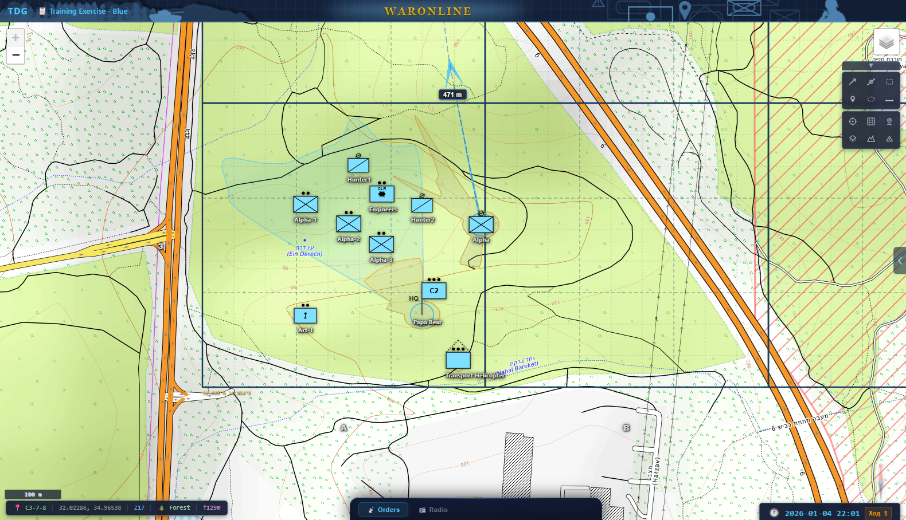

# TDG — Платформа тактических командно-штабных учений

> 🌐 [English](README.md) | **Русский**

Многопользовательская веб-платформа для проведения тактических и командно-штабных учений с имитацией действий противника на основе ИИ, совместным нанесением обстановки на карту, анализом местности и автоматическим распознаванием боевых приказов на естественном языке.

---

## Содержание

1. [Возможности](#возможности)
2. [Быстрый старт](#быстрый-старт)
3. [Архитектура развёртывания](#архитектура-развёртывания)
4. [Настройка окружения](#настройка-окружения)
5. [Среда разработки](#среда-разработки)
6. [Конвейер разбора приказов](#конвейер-разбора-приказов)
7. [Правила и механика боя](#правила-и-механика-боя)
8. [Типы подразделений](#типы-подразделений)
9. [Конфигурационные файлы](#конфигурационные-файлы)
10. [Тестирование](#тестирование)
11. [Документация по API](#документация-по-api)
12. [Структура проекта](#структура-проекта)
13. [Технологический стек](#технологический-стек)

---

## Возможности

### Карта и визуализация

- **Интерактивная тактическая карта** — Leaflet с условными знаками MIL-STD-2525D (milsymbol.js), масштабируемые тактические знаки, координатная сетка с рекурсивным «улиточным» дроблением, отметки командных высот (▲)
- **Туман войны** — серверная фильтрация через PostGIS `ST_DWithin` + зоны прямой видимости (ЗПВ); принадлежность и эшелон противника скрыты; разведывательные подразделения в режиме маскировки практически недосягаемы
- **Зона прямой видимости** — лучевое зондирование (72 луча); лесные массивы и капитальные строения перекрывают наблюдение; высота наблюдательной позиции задаётся типом подразделения
- **Совместное нанесение обстановки** — рисование в реальном времени (стрелки, ломаные, прямоугольники, маркеры, эллипсы, измерение дальности) с синхронизацией по WebSocket

### Местность и объекты

- **Анализ местности** — автоматическая классификация по данным OSM Overpass + ESA WorldCover + Open-Elevation; 12 типов местности с тактическими коэффициентами; ручная корректировка; SSE-прогресс в реальном времени
- **Инженерные заграждения и объекты** — проволочные заграждения, МВЗ, окопы, рвы, надолбы, ДОТы, мосты, КП, склады горюче-смазочных материалов, аэродромы с поворотной ВПП. Условные знаки НАТО, обнаружение по принадлежности
- **Зональные поражающие факторы** — дымовая завеса, туман, пожар, химическое облако (полигональные, затухающие по времени); визуальные эффекты разрывов

### Боевое моделирование

- **Боевой расчётный модуль** — детерминированное потактовое моделирование: выдвижение по маршруту A*, разведка на основе ЗПВ, огневое поражение прямой наводкой и по площади, подавление, моральное состояние, МТО, управление и связь, инженерное оборудование позиций, восстановление боеспособности
- **Тактическая прокладка маршрута (A\*)** — прокладка путей с учётом проходимости (~333 м/ячейка); учитываются МВЗ, зоны наблюдения противника, укрытия; режим движения определяет стратегию; сглаживание сплайном Катмулла–Рома
- **Преимущество обороны** — соотношение потерь 1,77:1 в пользу обороняющегося при равных силах; атакующий −35%, обороняющийся +15%; «окно прорыва» при подавлении > 60%
- **Распределение огневых задач** — подразделения, атакующие одну цель, получают автоматические роли: подавление (~40%), штурм (1–2 пехотных подразделения), обход фланга (под углом 60° через укрытую местность)
- **Взаимодействие артиллерии и пехоты** — трёхуровневая защита от поражения своих: запрос прекращения огня при сближении на 250 м, автоматическое прекращение («опасная близость» 50 м), проверка безопасности при огне по площади
- **Авиация и воздушно-десантные операции** — 3 типа авиационных средств без ограничений по рельефу; задачи: воздушный десант, МЕДЭВАК, авиационный удар

### Управление и связь

- **Система боевого управления** — иерархическое дерево подразделений, контроль полномочий, назначение офицеров, деление/слияние подразделений, drag-and-drop реорганизация
- **МТО** — пункты боепитания (+10%/шаг), подразделения тылового обеспечения (+8%/шаг), медицинские пункты (+1% боеспособности/шаг); задача «пополнение боекомплекта» с автоматическим выдвижением
- **Тактическая радиосвязь** — каналы «Все / Переговоры / Подразделения», автоматические доклады: выполнение задачи, запросы поддержки, рапорты о потерях, координация огневых задач, встреча с противником на выдвижении
- **Боевые донесения** — РАЗВЕДДОНЕСЕНИЕ, ДОНЕСЕНИЕ ОБ ОБСТРЕЛЕ, ДОНЕСЕНИЕ О ПОТЕРЯХ, ДОКЛАД ОБ ОБСТАНОВКЕ, РАЗВЕДЫВАТЕЛЬНАЯ СВОДКА; двуязычные; значок непрочитанных сообщений

### Разбор приказов и ИИ

- **Парсинг боевых приказов (LLM)** — ввод текстом (GPT-4.1, RU/EN), трёхуровневая маршрутизация (словарь → nano → полная модель), детерминированный боевой замысел (25+ правил), радиодоклады с тактической оценкой, немедленная постановка задачи
- **Словарь боевых приказов** — `order_phrasebook.toml`: двуязычный лексикон, типы задач, боевые порядки, правила огня, объекты местности, 60+ регрессионных проверок
- **Поддержка закрытого контура** — llama.cpp с API, совместимым с OpenAI; три режима: `llm_first`, `keyword_first`, `keyword_only`
- **ИИ-противник** — 4 доктринальных профиля (агрессивный / сбалансированный / осторожный / оборонительный), LLM-решения с алгоритмическим резервом

### Инструменты руководителя учений

- **Панель руководства** — мастер создания учения (4 шага), режим «всевидящего», конструктор тактических задач, редактор системы управления, анализ местности, редактор типов подразделений, вкладка тактических объектов и зональных эффектов (Объекты), журнал отладки, управление агентами ИИ-противника (вкладка ИИ-противник)
- **Ввод вводных** — `breakdown`, `comms_failure`, `position_error`, `ammo_shortage`, `fuel_depletion`, `commander_casualty` с длительностью и степенью воздействия
- **Воспроизведение хода учений** — пошаговый просмотр (0,5×–4×), ползунок шкалы времени, ААР (разбор действий от ИИ)
- **Самообучение словаря** — межсессионная кластеризация, ИИ-оценка, утверждение оператором, горячая перезагрузка `order_phrasebook.toml` (раздел «Анализ обучения» во вкладке Монитор)

### Интерфейс

- **Многоязычный интерфейс** — переключение RU/EN через `KI18n`; атрибуты `data-i18n`; мгновенный перерендеринг
- **Вводный инструктаж** — автозапуск при первом входе (`KTutorial`), прохождение сохраняется на сервере
- **Редактируемая конфигурация** — `unit_types.json`, `units_config.json` вместо жёстко прописанных констант

---

## Быстрый старт

### Развёртывание в рабочей среде (рекомендуется)

Одна команда запускает весь стек: PostgreSQL + Redis + Backend + Nginx + локальный LLM.

```powershell
# 1. Клонировать и настроить
git clone <repository-url>
Set-Location KShU
Copy-Item .env.example .env
# Открыть .env и заполнить OPENAI_API_KEY, SECRET_KEY, ADMIN_PASSWORD

# 2. Развернуть весь стек
.\deploy.ps1

# 3. Открыть в браузере
# Интерфейс:      http://localhost
# API-доки:       http://localhost/api/docs
# Локальный LLM:  http://localhost:8081
```

#### Параметры скрипта развёртывания

| Флаг | Описание |
|---|---|
| *(без флага)* | Собрать образы (из кэша) и запустить весь стек |
| `--rebuild` | Полная пересборка с `--no-cache`. **База данных сохраняется** |
| `--clean` | **Полная очистка**: удалить тома (данные стёрты), пересобрать с нуля |
| `--down` | Остановить контейнеры. **Том БД сохраняется** |
| `--logs` | Следить за журналами после запуска (`Ctrl+C` для выхода) |

```powershell
.\deploy.ps1 --rebuild          # принудительная пересборка
.\deploy.ps1 --rebuild --logs   # пересборка + слежение за журналом
.\deploy.ps1 --clean            # полный сброс
.\deploy.ps1 --down             # остановить всё
```

> **Отключить локальный LLM:** закомментировать `COMPOSE_PROFILES=llm` в `.env`.

---

## Архитектура развёртывания

```
Браузер (http://localhost)
        ↓
    Nginx (порт 80)
    ├─→ Статические файлы фронтенда
    ├─→ /api/*  →  Backend:8000
    └─→ /ws/*   →  Backend:8000 (WebSocket)
            ↓
    FastAPI Backend (порт 8000)
    ├─→ PostgreSQL:5432 (+ PostGIS)
    ├─→ Redis:6379 (pub/sub + кэш)
    └─→ LLM:8081 (llama.cpp)
```

| Сервис     | Порт | Описание                              |
|------------|------|---------------------------------------|
| `nginx`    | 80   | Обратный прокси + статика фронтенда  |
| `backend`  | 8000 | FastAPI + автоматические миграции БД |
| `postgres` | 5432 | PostgreSQL 16 + PostGIS 3.4          |
| `redis`    | 6379 | Pub/sub, кэш сессий                  |
| `llm`      | 8081 | llama.cpp, OpenAI-совместимый API    |

Все сервисы имеют проверки работоспособности, политики перезапуска и корректные цепочки зависимостей.

---

## Настройка окружения

Скопировать `.env.example` в `.env`. Обязательные параметры:

```env
OPENAI_API_KEY=sk-...         # разбор приказов и ИИ-противник
SECRET_KEY=<random-64-chars>  # JWT-токены
ADMIN_PASSWORD=<strong-pass>  # панель руководства
```

Дополнительные параметры:

```env
LOCAL_MODEL_URL=http://localhost:8081/v1
LOCAL_MODEL_NAME=local
LOCAL_TRIAGE_ENABLED=true
LLM_PARSING_MODE=llm_first    # llm_first | keyword_first | keyword_only

OPENAI_MODEL=gpt-4.1
OPENAI_MODEL_MINI=gpt-4.1-mini
OPENAI_MODEL_NANO=gpt-4o-mini
```

Сгенерировать `SECRET_KEY` (PowerShell):

```powershell
[Convert]::ToBase64String((1..48 | ForEach-Object { [byte](Get-Random -Max 256) }))
```

### Журналы и устранение неисправностей

```powershell
# Все журналы
docker compose logs -f

# Конкретный сервис
docker compose logs -f backend
docker compose logs -f llm

# Состояние сервисов
docker compose ps
Invoke-WebRequest http://localhost/health
```

| Проблема | Решение |
|---|---|
| Backend не запускается | Проверить `OPENAI_API_KEY`; подождать 30 с (авт. повторные попытки подключения к БД) |
| Ошибка миграций | `docker compose exec backend alembic upgrade head` |
| Nginx 502 | Backend ещё не прошёл healthcheck: `docker compose restart backend` |
| LLM не отвечает | `docker compose logs llm`, затем `python scripts\warm_local_llm.py` |

Полный сброс базы данных:

```powershell
.\deploy.ps1 --down
docker volume rm tdg_pgdata
.\deploy.ps1
```

### Сохранность данных

Том `pgdata` **сохраняется** при `--down` и подключается повторно при следующем запуске.

```powershell
# Резервная копия перед сбросом
docker compose exec postgres pg_dump -U tdg tdg > backup.sql

# Полный сброс с удалением данных
.\deploy.ps1 --clean
```

Обновление платформы:

```powershell
git pull
.\deploy.ps1 --rebuild
```

### Развёртывание на собственном домене (`tdg.alpha-numerical.com`)

TDG можно опубликовать под собственным доменом с автоматическим TLS через общий
Caddy reverse-proxy (тот же, что используется SmartVoter на одном сервере).
Prod-оверлей `docker-compose.prod.yml` убирает публикацию портов 80/443 у nginx
и подключает его к внешней Docker-сети `web`, через которую Caddy обращается к нему.

Полная пошаговая инструкция (DNS, создание сети, правка Caddyfile, деплой, проверка,
откат): **[docs/DEPLOY_DOMAIN.md](docs/DEPLOY_DOMAIN.md)**.

### Усиление защиты для боевой эксплуатации

1. Сменить `SECRET_KEY`, `ADMIN_PASSWORD` и пароли БД в `docker-compose.yml`
2. Включить HTTPS — SSL в nginx или обратный прокси (Traefik, Caddy)
3. Ограничения ресурсов в `docker-compose.yml` для сервиса `backend`:
   ```yaml
   deploy:
     resources:
       limits:
         cpus: '2'
         memory: 4G
   ```
4. Регулярное резервное копирование тома `pgdata`

---

## Среда разработки

Для активной разработки с горячей перезагрузкой:

```powershell
# 1. Запустить инфраструктуру (PostgreSQL + Redis)
docker compose up -d

# 2. Создать виртуальное окружение и установить зависимости
python -m venv .venv
.venv\Scripts\Activate.ps1
pip install -r requirements.txt

# 3. Настроить переменные окружения
Copy-Item .env.example .env
# Открыть .env и заполнить OPENAI_API_KEY

# 4. Заполнить БД тестовыми данными
python -m scripts.seed_scenario

# 5. Запустить сервер
uvicorn backend.main:app --reload --host 0.0.0.0 --port 8000

# 6. Открыть http://localhost:8000
```

### Локальный LLM (закрытый контур, без интернета)

```powershell
# Скачать модель (Gemma 3 1B Instruct Q4_K_M, ~800 МБ)
.\scripts\download_model.ps1

# Запустить нативно (быстрее, чем через Docker):
.\tools\llama-cpp\llama-server.exe `
    --model models\model.gguf `
    --alias local `
    --host 127.0.0.1 `
    --port 8081 `
    --ctx-size 4096 `
    --threads 8 `
    --reasoning off `
    --no-webui `
    --mlock
```

В `.env`:

```env
LOCAL_MODEL_URL=http://localhost:8081/v1
LOCAL_MODEL_NAME=local
LLM_PARSING_MODE=llm_first
```

---

## Конвейер разбора приказов

```
Командир вводит текст приказа
             │
             ▼
┌────────────────────────────────────────────────────┐
│  1. СЛОВАРНЫЙ АНАЛИЗ  (~0 мс)                      │
│     order_phrasebook.toml                          │
│     → ParsedOrderData + достоверность 0.15–0.90    │
└──────────────────────┬─────────────────────────────┘
                       │
                       ▼
┌────────────────────────────────────────────────────┐
│  2. ЛОКАЛЬНАЯ ПРЕДСОРТИРОВКА  (опц., ~2 с)         │
│     Только: команда / подтверждение / донесение?   │
│     Совпадает со словарём → повысить достов.       │
│     Расходится → снизить / принудить полную модель │
└──────────────────────┬─────────────────────────────┘
                       │
                       ▼
┌────────────────────────────────────────────────────┐
│  3. РЕШЕНИЕ О МАРШРУТИЗАЦИИ                        │
│                                                    │
│  Не команда + достов. ≥ 0.95  ──►  без LLM         │
│  Команда   + достов. ≥ 0.70  ──►  Cloud NANO       │
│  Команда   + достов. < 0.70  ──►  Cloud FULL       │
└──────────────────────┬─────────────────────────────┘
                       │
                       ▼
┌────────────────────────────────────────────────────┐
│  4. ФОРМИРОВАНИЕ КОНТЕКСТА                         │
│     - Боевой устав (RAG): топ-6 блоков ≤ 2 КБ      │
│     - Таблица подразделений: 18 по релевантности   │
│     - 9 контекстных блоков:                        │
│       местность, контакты, состояние, задачи,      │
│       обстановка, приказы, радиосвязь,             │
│       донесения, объекты местности                 │
│     - Пакет состояния ≤ 2400 символов              │
└──────────────────────┬─────────────────────────────┘
                       │
                       ▼
┌────────────────────────────────────────────────────┐
│  5. ОБРАЩЕНИЕ К CLOUD LLM                          │
│     SYSTEM ~3–5 К токенов: устав, сетка,           │
│       подразделения, контекст                      │
│     USER ~0.5–1.5 К токенов: текст, состояние,     │
│       примеры по типу приказа + языку              │
│     → JSON → Pydantic → ParsedOrderData            │
└──────────────────────┬─────────────────────────────┘
                       │
                       ▼
┌────────────────────────────────────────────────────┐
│  6. СОГЛАСОВАНИЕ  _reconcile_llm_result()          │
│     Явный командный фрейм → не понижать тип        │
│     Nano вернул неоднозначно → полная модель       │
└──────────────────────┬─────────────────────────────┘
                       │
                       ▼
                 ParsedOrderData
                /       │        \
       Интерпр.   Определитель   Генератор
       боевого    местоположения радиоответа
       замысла    (сетка/улитка/ (по шаблону)
      (25+ правил) коорд./высота)
                \       │        /
                   OrderService
             (сохранить + поставить задачу)
                        │
                 WebSocket → клиенты
```

### Загрузка положений боевого устава

- `FIELD_MANUAL.md` — единственный источник тактических нормативов
- `backend/prompts/tactical_doctrine.py` загружает полные блоки (для ИИ-противника), сокращённые блоки (для разбора приказов) и тематические фрагменты `DOCTRINE:TOPIC:*`
- Нормативы выбираются по типу задачи: `fires` / `recon` / `engineers` / `logistics` / `aviation` / `map_objects` / `split_merge`

---

## Правила и механика боя

### Потактовое моделирование

По умолчанию 1 минута игрового времени на шаг. Последовательность обработки:

| № | Этап | Описание |
|---|---|---|
| 1 | **ИИ-противник** | Решения за подразделения «красных» |
| 2 | **Боевые приказы** | Постановка задач; немедленная постановка при подтверждении |
| 3 | **Прокладка маршрутов** | A* для всех выдвигающихся подразделений |
| 4 | **Выдвижение** | Маршрутные точки; местность, уклон, подавление, мораль, погода; останов перед МВЗ и водными преградами без переправ |
| 5 | **Разведка и обнаружение** | ЗПВ, создание/обновление контактов, учёт маскировки |
| 6 | **Инженерная разведка** | Раскрытие скрытых объектов в ЗПВ |
| 7 | **Устаревание контактов** | Затухание и аннулирование |
| 8 | **Огневая поддержка** | Назначение артиллерии; приоритет явных запросов; координация прекращения огня |
| 9 | **Инженерное оборудование** | Оборонительные подразделения повышают степень оборудования позиций |
| 10 | **Ответный огонь** | Автоматическое открытие огня по ближайшему (кроме выходящих из боя) |
| 11 | **Огневое поражение** | Роли (подавление/штурм/обход фланга); огонь по площади R=150 м; лимит 3 залпа; опасная близость 50 м |
| 12 | **Восстановление после подавления** | Обороняющиеся/неподвижные 0,05/шаг; атакующие/выдвигающиеся 0,02/шаг |
| 13 | **Моральное состояние** | Подавление и потери снижают; близость своих и уничтожение противника повышают; марш-усталость |
| 14 | **Управление и связь** | Интенсивное подавление нарушает связь |
| 15 | **Расход боеприпасов и пополнение** | Пункты боепитания и подразделения МТО пополняют соседей |
| 16 | **Боевые события и донесения** | Автоматическая генерация 5 типов донесений |
| 17 | **Радиообмен** | Доклады о задачах, потерях, огневых задачах, координации, встрече с противником |
| 18 | **Зональные факторы** | Урон от пожаров и химического заражения; затухание истёкших эффектов |
| 19 | **Оценка выполнения задачи** | Детерминированная проверка рубежей + ИИ-арбитр каждые 5 шагов + лимит шагов |
| 20 | **Рассылка** | Обновлённая обстановка всем участникам через WebSocket |

### Передвижение

```
v_расч = v_баз × К_местн × К_уклон × (1 − подавл. × 0,7) × К_морал × К_погода
```

| Тип местности     | К_местн |
|-------------------|---------|
| Дорога            | 1,0     |
| Открытая местность| 0,8     |
| Поля              | 0,7     |
| Лес               | 0,5     |
| Застройка         | 0,4     |
| Болото            | 0,3     |
| Вода              | 0,05    |

Поправка на уклон: `max(0,2;  1,0 − крутизна_°/45)`

**Авиация** — движение без каких-либо ограничений по местности.

### Разведка и обнаружение

```
P_обн = P_баз × (1 − d/D_ср) × К_положение × К_разв × К_маскир
```

- Маскировка разведывательных подразделений: дальность ≤ 300 м, P_баз = 10%, предел 25%
- Детерминированный хэш (BLAKE2b) гарантирует воспроизводимость при разборе учения

### Огневое поражение

```
Э_огн = Э_баз × боеспос. × К_бп × (1 − подавл.) × К_местн × К_положение
```

**Модификатор боевого положения** (метод QJM Дюпюи):

| Ситуация | Модификатор |
|---|---|
| Атакующий | ×**0,65** — под огнём, без заранее подготовленных позиций |
| Обороняющийся | ×**1,15** — пристрелянные секторы, карточки огня |
| Равные силы в поле | **1,77:1** в пользу обороны |
| При подавлении > 60% | Штраф атакующего линейно обнуляется («окно прорыва») |

Обход фланга: −25% к защите противника. Высотное преимущество: +15% огневой эффективности.

---

## Типы подразделений

Всего **43 типа** определены в `frontend/config/unit_types.json`, каждый содержит:
- коды SIDC (синие/красные), соответствующие MIL-STD-2525D
- скорости тихого и ускоренного марша (м/с)
- дальность обнаружения, дальность огня, численность личного состава
- высоту наблюдения для расчёта ЗПВ
- признак непрямого огня (миномёты, артиллерия)

**Средства ПВО** (4 типа):

| Тип | Численность | Дальность огня |
|---|---|---|
| Расчёт ПЗРК | 4 чел. | 3 км |
| Отделение ПЗРК | 8 чел. | 3,5 км |
| Батарея ЗРК | 12 чел. | 8 км (обнаружение 10 км) |
| Зенитная артиллерия | 10 чел. | 2,5 км |

**Авиация** (3 типа):

| Тип | Скорость (макс.) | Обнаружение | Огонь | Высота набл. |
|---|---|---|---|---|
| Ударный вертолёт | 70 м/с | 5 км | 4 км | 100 м |
| Военно-транспортный вертолёт | 60 м/с | 3 км | — | 150 м |
| Разведывательный БПЛА | 35 м/с | 8 км | — | 200 м |

Авиационные задачи: `air_assault` (воздушный десант), `casevac`/`medevac` (медицинская эвакуация), `airstrike` (авиационный удар).

---

## Руководство по работе с платформой

1. Введите позывной и пароль → **Зарегистрироваться** (первый раз) или **Войти**
2. При первом входе автоматически запускается **вводный инструктаж** (KTutorial)
3. Выберите учение из списка (учения создаются руководителем)
4. Нажмите **Запустить учение** для инициализации подразделений
5. Используйте **панель управления картой** (правый верхний угол): сетка, подразделения, знаки, контакты, слой местности
6. **Нанесение обстановки** — выбрать инструмент и нанести на карту; синхронизация в реальном времени
7. **Управление подразделениями**:
   - ЛКМ — выбрать подразделение
   - Shift+ЛКМ — добавить к выбранным
   - Удержание ЛКМ — выборка прямоугольником
   - Alt+ЛКМ — выбор при наложении нескольких знаков
   - ПКМ — контекстное меню (выдвижение 🐢/⚡, боевой порядок, деление, слияние)
8. **Боевой приказ** — вкладка **📡 Приказы** нижней командной панели (выбрать подразделения или нажать **👥 Все**)
9. **Радиосвязь** — вкладка **📻 Радио**, выбор адресата, фильтр каналов
10. **Выполнить приказы** — выдвижение по маршрутам A*, обнаружение, бой, радиодоклады
11. Ссылки на **командные высоты** в приказах: *«Выдвинуться в направлении высоты 170»*
12. **Смена языка** — настройки пользователя → English / Русский
13. **Разбор учения** — навести на игровые часы (правый нижний угол) → **Воспроизведение** → **ААР**

### Панель руководства учениями (🔑 + пароль)

| Раздел | Возможности |
|---|---|
| **Учение** | Запуск/пауза/шаг; мастер создания (4 шага); сброс |
| **Монитор** | Режим «всевидящего»; журнал подразделений; журнал отладки; **ввод вводных**; 🎓 **Анализ обучения** (кластеризация словаря, утверждение предложений, горячая перезагрузка) |
| **Конструктор** | Расстановка подразделений на карте; настройка сетки; сохранение в сценарий |
| **КВ** | Drag-and-drop переподчинение; массовое назначение/снятие |
| **Пользователи** | Управление участниками учения |
| **Типы** | Редактор типов подразделений с живым SIDC-превью |
| **Местность** | Анализ (OSM + ESA + высоты); ручная корректировка ячеек; очистка |
| **Объекты** | Размещение заграждений (МВЗ, проволока, окопы), сооружений (мосты, КП, аэродромы) и зональных эффектов (дымовая завеса, туман, пожар, хим. облако) |
| **ИИ-противник** | Создание/редактирование агентов ИИ-командира «красных» (доктринальные профили, боевой замысел, подчинённые подразделения); принудительное решение |

### Инженерные заграждения и объекты

При открытой панели руководства доступно размещение:
- **Заграждения**: проволочные заграждения, МВЗ, окопы, противотанковые рвы, надолбы
- **Сооружения**: ДОТы, мосты, КП, склады ГСМ, аэродромы, наблюдательные вышки

Поворот ВПП аэродрома — маркер **↻** на торце. Правый клик → контекстное меню (активировать, переключить обнаружение, удалить). Заграждения скрыты по умолчанию — обнаруживаются при выходе ЗПВ подразделения.

---

## Конфигурационные файлы

| Файл | Назначение |
|---|---|
| `frontend/config/unit_types.json` | Реестр типов подразделений: SIDC, скорости, дальности, численность, высота наблюдения |
| `frontend/config/units_config.json` | Иконки состояния, боевые порядки, параметры стрелок движения и выборки |
| `backend/data/order_phrasebook.toml` | Двуязычный лексикон + регрессионные проверки |
| `FIELD_MANUAL.md` | Единственный источник тактических нормативов |
| `backend/config.py` | URL базы данных, Redis, ключи API, параметры LLM |
| `.env` | Секреты и переопределения (не добавлять в репозиторий) |
| `docker-compose.yml` | Оркестрация контейнеров (postgres, redis, backend, nginx, llm) |
| `nginx.conf` | Конфигурация обратного прокси для рабочей среды |

---

## Тестирование

### Тактические сценарные испытания

```powershell
# Запустить все тактические сценарии (требуется запущенная инфраструктура)
python -m scripts.tactical_tests.run_all
# Результат: tactical_test_report.html
```

**10 тестовых сценариев:**

| Сценарий | Что проверяет |
|---|---|
| Базовое выдвижение | Скорости движения по типам подразделений |
| Бронированный прорыв | Взаимодействие родов войск |
| Оборонительный бой | Оборудование позиций, ответный огонь |
| Взаимодействие | Координация комбинированного боя |
| Разведка с маскировкой | Незаметность разведывательных подразделений |
| Встречный бой | Взаимное обнаружение |
| Бой в городе | Влияние застройки на параметры боя |
| Ночные действия | Модификаторы видимости |
| Форсирование водной преграды | Требование наличия переправ |
| Отход под давлением | Моральное состояние, выход из боя |

### Регрессионные тесты словаря

`backend/data/order_phrasebook.toml` содержит **60+ записей `[[case]]`** — автоматические тесты словарного анализатора. Каждая запись задаёт входной текст и ожидаемые результаты: классификацию, тип задачи, объекты, режим движения.

---

## Документация по API

FastAPI автоматически формирует интерактивную документацию:

| Среда | Swagger UI | ReDoc |
|---|---|---|
| Рабочая | `http://localhost/api/docs` | `http://localhost/api/redoc` |
| Разработка | `http://localhost:8000/docs` | `http://localhost:8000/redoc` |

---

## Структура проекта

Полная архитектура и доменная модель — в [AGENTS.MD](AGENTS.MD).

```
KShU/
├── AGENTS.MD                       # Архитектура и план реализации
├── FIELD_MANUAL.md                 # Боевой устав (единый источник нормативов)
├── README.md                       # Документация (English)
├── README.ru.md                    # Документация (Русский)
├── requirements.txt
├── docker-compose.yml              # PostgreSQL+PostGIS, Redis, backend, nginx, llama.cpp
├── Dockerfile                      # Многоступенчатая сборка backend
├── docker-entrypoint.sh            # Автоматические миграции БД при старте контейнера
├── nginx.conf                      # Обратный прокси + раздача статики
├── deploy.ps1                      # Скрипт развёртывания (Windows PowerShell)
├── alembic.ini
├── .env
│
├── backend/
│   ├── main.py                     # Фабрика FastAPI, маршруты, CORS
│   ├── config.py                   # Настройки Pydantic (из переменных окружения)
│   ├── database.py                 # Async SQLAlchemy, пул соединений
│   │
│   ├── models/                     # SQLAlchemy-модели (16 таблиц)
│   │   ├── unit.py / order.py / session.py / scenario.py
│   │   ├── map_object.py           # Тактические объекты (заграждения, сооружения)
│   │   ├── terrain_cell.py         # Ячейки местности (улиточный путь → тип + коэффициенты)
│   │   ├── elevation_cell.py       # Ячейки рельефа (высота/уклон/азимут)
│   │   └── learning_proposal.py    # Предложения для расширения словаря
│   │
│   ├── api/                        # REST и WebSocket эндпоинты
│   │   ├── admin.py                # Управление сессией, подразделениями, участниками
│   │   ├── orders.py / units.py / sessions.py / scenarios.py
│   │   ├── map_objects.py          # CRUD тактических объектов
│   │   ├── terrain.py              # Анализ местности, окраска, прокладка маршрута
│   │   └── websocket.py            # WebSocket-хаб с Redis pub/sub
│   │
│   ├── engine/                     # Детерминированный боевой расчётный модуль
│   │   ├── tick.py                 # Главный оркестратор тика
│   │   ├── movement.py / detection.py / combat.py
│   │   ├── morale.py / suppression.py / comms.py / ammo.py
│   │   ├── defense.py              # Прогрессия оборудования позиций
│   │   ├── engineering.py          # Взаимодействие сапёров с объектами
│   │   ├── map_objects.py          # Эффекты объектов на подразделения
│   │   ├── radio_chatter.py        # Автогенерация радиообмена
│   │   ├── resupply.py             # Система пополнения боеприпасов
│   │   ├── intent_cascade.py       # Распространение замысла от штаба на подчинённых
│   │   ├── geo_utils.py            # Географические утилиты (единый источник)
│   │   └── _rng.py                 # Детерминированный BLAKE2b ГСЧ для воспроизводимости
│   │
│   ├── services/
│   │   ├── order_parser.py         # 3-уровневая маршрутизация LLM
│   │   ├── order_phrasebook.py     # Загрузчик TOML-словаря
│   │   ├── pathfinding_service.py  # Тактическая прокладка маршрута A*
│   │   ├── retrieval_context.py    # Оптимизация промптов и получение контекста
│   │   ├── local_triage.py         # Локальный LLM-классификатор
│   │   ├── los_service.py          # Расчёт ЗПВ (лучевое зондирование)
│   │   ├── visibility_service.py   # Туман войны, полномочия командования
│   │   ├── report_generator.py     # Автогенерация 5 типов донесений
│   │   ├── learning/               # Самообучение словаря
│   │   └── terrain_analysis/       # Анализаторы OSM, ESA WorldCover, высот
│   │
│   ├── data/
│   │   └── order_phrasebook.toml   # Двуязычный лексикон + регрессионные тесты
│   ├── prompts/                    # Шаблоны промптов LLM
│   ├── schemas/                    # Схемы Pydantic v2
│   └── tests/                      # Модульные и интеграционные тесты
│
├── frontend/
│   ├── index.html
│   ├── config/
│   │   ├── unit_types.json         # Реестр типов подразделений
│   │   └── units_config.json       # Параметры отображения и поведения
│   ├── css/style.css
│   └── js/
│       ├── app.js                  # Точка входа, WS-обработчики
│       ├── map.js                  # Инициализация Leaflet, игровые часы
│       ├── units.js                # Подразделения, выборка, выдвижение
│       ├── orders.js               # Командная панель + радиосвязь
│       ├── admin.js                # Панель руководства (~4300 строк)
│       ├── i18n.js                 # Многоязычный интерфейс RU/EN
│       ├── replay.js               # Воспроизведение хода учения + ААР
│       ├── tutorial.js             # KTutorial — вводный инструктаж
│       ├── terrain.js              # Слой местности, легенда, изолинии
│       ├── map_objects.js          # Тактические объекты
│       ├── overlays.js             # Инструменты рисования
│       ├── dialogs.js              # Тематические диалоговые окна
│       └── contacts.js / events.js / reports.js / gamelog.js
│
├── scripts/
│   ├── seed_scenario.py            # Заполнение БД тестовыми данными
│   ├── download_model.ps1          # Загрузка локальной LLM-модели
│   └── tactical_tests/             # Стенд тактических сценариев
│       ├── runner.py               # Создание сессий, инъекция приказов, тики
│       ├── run_all.py              # Точка входа CLI; генерирует HTML-отчёт
│       └── scenarios/              # 10 тактических сценариев (s01–s10)
│
└── models/                         # Файлы LLM-модели (GGUF)
```

---

## Технологический стек

| Уровень | Технология |
|---|---|
| Фронтенд | Leaflet 1.9, Leaflet.Editable, milsymbol.js, Vanilla JS |
| Бэкенд | Python 3.12, FastAPI, SQLAlchemy 2.0, GeoAlchemy2 |
| База данных | PostgreSQL 16 + PostGIS 3.4 |
| Кэш / PubSub | Redis 7 |
| Развёртывание | Docker, Docker Compose, Nginx |
| ИИ | OpenAI GPT-4.1 / GPT-5 (разбор приказов, ИИ-противник, радиодоклады, ААР) + llama.cpp резерв (Gemma/Qwen GGUF) |
| Геопространственные | Shapely, pyproj, PostGIS |
| Данные о местности | OSM Overpass API, ESA WorldCover 2021, Open-Elevation API |
| Интернационализация | Собственный модуль KI18n (RU/EN словари) |
